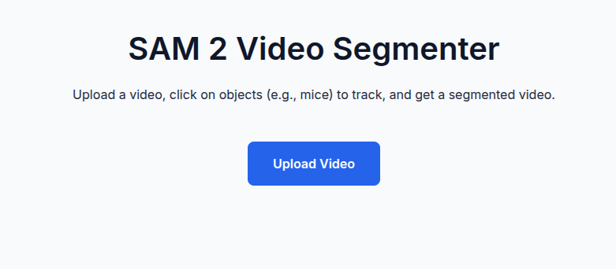
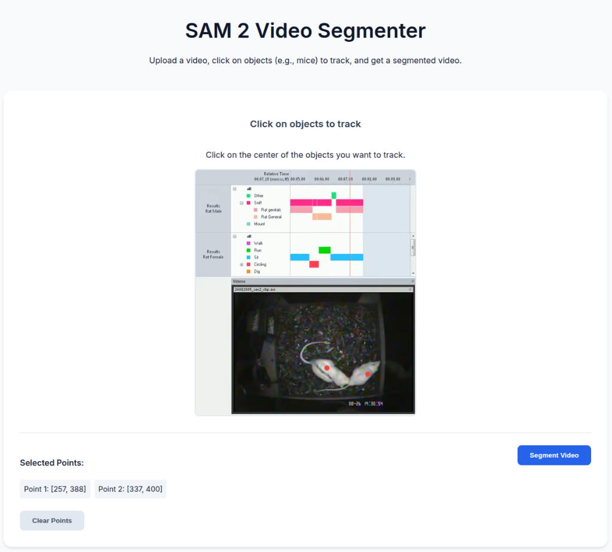
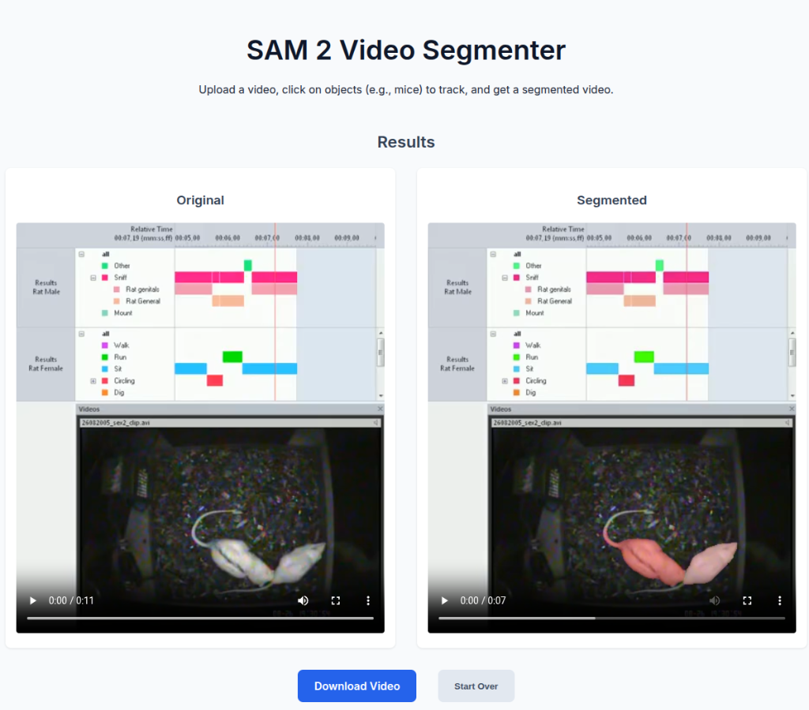

# SAM 2 Video Segmenter

Meta의 **SAM 2 (Segment Anything Model 2)**를 활용하여 비디오 내의 객체를 인터랙티브하게 분할(Segmentation)하고 추적(Tracking)하는 웹 서비스입니다.

사용자가 비디오를 업로드하고 추적하고 싶은 객체(예: 쥐, 사람, 자동차 등)를 클릭하면, AI가 자동으로 해당 객체를 인식하여 영상 전체에서 추적하고 분할된 결과를 보여줍니다.

## 📸 동작 화면

### 1. 메인 화면 (비디오 업로드)
서비스에 접속하면 가장 먼저 보이는 화면입니다. 분석할 비디오 파일(MP4, MOV 등)을 업로드합니다.


### 2. 객체 선택 (인터랙션)
비디오가 로드되면 첫 번째 프레임이 표시됩니다. 여기서 추적하고 싶은 객체의 중심을 마우스로 클릭합니다. 클릭한 지점은 빨간색 점으로 표시되며, 여러 객체를 동시에 추적할 수도 있습니다. 선택이 완료되면 **"Segment Video"** 버튼을 누릅니다.


### 3. 결과 확인 및 다운로드
AI 분석이 완료되면 원본 영상과 세그멘테이션된 영상이 나란히 표시됩니다. 우측 영상에서 객체가 색상으로 구분되어 추적되는 것을 확인할 수 있습니다. **"Download Video"** 버튼을 눌러 결과 영상을 MP4 파일로 저장할 수 있습니다.


---

## 🛠️ 설치 및 실행 가이드

이 프로젝트는 Python (FastAPI) 백엔드와 HTML/JS 프론트엔드로 구성되어 있습니다. Windows와 Linux 환경 모두에서 실행 가능합니다.

### 사전 요구 사항 (Prerequisites)
- **Python 3.10 이상**이 설치되어 있어야 합니다.
- **Replicate API Token**이 필요합니다. [Replicate](https://replicate.com/)에서 계정을 생성하고 토큰을 발급받으세요. (이 모델은 유료 크레딧이 필요할 수 있습니다.)

### 1. 프로젝트 클론 (Clone)
```bash
git clone https://github.com/bellmake/sam2-video-segmenter.git
cd sam2-video-segmenter
```

### 2. 가상환경 생성 및 활성화 (Conda 권장)

이 프로젝트는 `conda` 가상환경 사용을 권장합니다.

```bash
# Conda 환경 생성 (Python 3.10)
conda create -n sam2 python=3.10 -y

# 가상환경 활성화
conda activate sam2
```

### 3. 의존성 패키지 설치
```bash
pip install -r requirements.txt
```

### 4. 환경 변수 설정 (.env)
프로젝트 루트 경로에 `.env` 파일을 생성하고, 발급받은 Replicate API 토큰을 입력합니다.

**`.env` 파일 생성:**
```bash
# Linux/macOS
touch .env

# Windows (메모장으로 생성)
notepad .env
```

**`.env` 파일 내용:**
```env
REPLICATE_API_TOKEN=r8_YourReplicateTokenHere...
```
> **주의:** `r8_`로 시작하는 실제 토큰 값을 입력해야 합니다.

### 5. 서버 실행
```bash
uvicorn main:app --reload
```
서버가 정상적으로 실행되면 터미널에 `Uvicorn running on http://127.0.0.1:8000` 메시지가 표시됩니다.

### 6. 웹 서비스 접속
웹 브라우저(Chrome 권장)를 열고 아래 주소로 접속합니다.
[http://localhost:8000/static/index.html](http://localhost:8000/static/index.html)

---

## ⚠️ 트러블슈팅 (Troubleshooting)

**Q. "Segmentation failed" 오류가 발생해요.**
- **401 Unauthorized**: `.env` 파일에 토큰이 정확히 입력되었는지 확인하세요.
- **402 Insufficient Credit**: Replicate 계정에 크레딧이 부족한 경우입니다. Billing 페이지에서 충전이 필요합니다.
- **Timeout**: 영상이 너무 길거나 고화질인 경우 처리가 오래 걸려 타임아웃이 발생할 수 있습니다. (현재 코드는 10분 대기하도록 설정됨)

**Q. 업로드가 안 돼요.**
- 파일 용량이 너무 크지 않은지 확인하세요. 짧은 클립(1분 이내)으로 테스트하는 것을 권장합니다.

---

## 📂 프로젝트 구조
```
sam2-video-segmenter/
├── main.py              # FastAPI 백엔드 서버
├── requirements.txt     # 파이썬 의존성 목록
├── .env                 # 환경 변수 (API 토큰) - *직접 생성 필요*
├── static/              # 프론트엔드 정적 파일
│   ├── index.html       # 메인 페이지
│   ├── script.js        # 프론트엔드 로직
│   └── style.css        # 스타일시트
└── assets/              # 스크린샷 이미지
```
